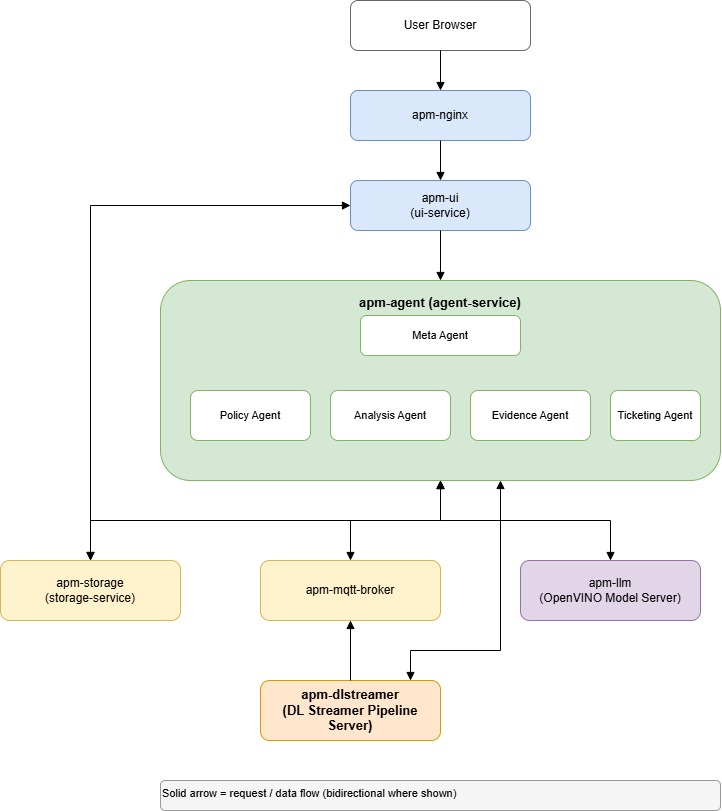

# Agentic Predictive Maintenance

The Agentic Predictive Maintenance (APM) blueprint deploys a config-driven, multi-agent sample application for industrial defect detection on Intel edge hardware. It runs DL Streamer video inference, stores detections, and uses a LangGraph-based multi-agent pipeline (Policy → Analysis → Evidence → Ticketing) to generate structured maintenance tickets — with no code changes needed between use cases.

## Get Started

To see the system requirements and other installations, see the following guides:

- [System Requirements](./docs/user-guide/get-started/system-requirements.md): Check the hardware and software requirements for deploying the application.
- [Get Started](./docs/user-guide/get-started.md): Follow step-by-step instructions to set up the application.

## How It Works

Clicking "Run Pipeline" starts the DL Streamer video-inference pipeline, waits for it to finish processing the source video, and then triggers a multi-agent reasoning pass over exactly the detections that run produced, generating structured maintenance tickets.

For more information see [How it works](./docs/user-guide/how-it-works.md)

## Learn More

- [Overview](./docs/user-guide/index.md)
- [Get Started](./docs/user-guide/get-started.md)
- [System Requirements](./docs/user-guide/get-started/system-requirements.md)
- [API Reference](./docs/user-guide/api-reference.md)
- [How to Build from Source](./docs/user-guide/build-from-source.md)
- [Troubleshooting](./docs/user-guide/troubleshooting.md)
- [Release Notes](./docs/user-guide/release-notes.md)
