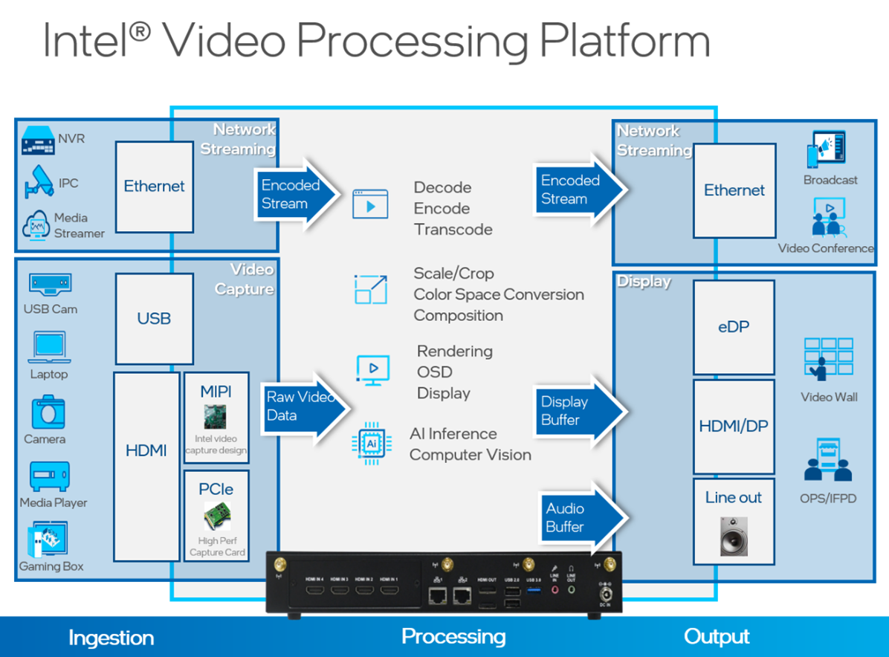

# How It Works

Video Processing for NVR is built on the **Video Processing Platform SDK**. This
section explains the underlying platform, the SDK architecture, and how the reference
applications are constructed on top of it.

## Intel® Video Processing Platform

*Figure 1: Intel® Video Processing Platform*

The Intel® Video Processing Platform is a collection of video-processing functions in the following
areas:

- Media (Decode, Encode)
- Post-processing (Scale, Crop, Composition)
- Display
- AI/CV
- Audio

These functions are critical to video-processing applications including:

- Network Video Recorder (NVR)
- Video Capture System
- Video Matrix

Video-processing workloads consume a large amount of computing resources, especially as
higher resolution and channel density are required. Consequently, these computations are
usually offloaded to accelerators like GPUs.

## Intel GPU

*Figure 2: Intel® GPU*

The Intel® integrated GPU is part of the Intel® Core™/Celeron® CPU. It has strong capability for
graphics and parallel computing tasks, including Media, Display, and AI/CV. Consequently,
an Intel Core/Celeron CPU can be a good option for the core processor of a VPP product.

## Video Processing Platform SDK Architecture

*Figure 3: Video Processing Platform SDK Architecture*

The Video Processing Platform SDK provides a set of APIs to construct pipelines with functions like video encoding,
post-processing, and display on the Linux platform. With these APIs, you can build your
applications and leverage the media capability of the Intel GPU. The Video Processing Platform SDK is based on
low-level media stacks like libVPL, libVA, Media Driver, and libdrm. It is an abstraction
layer that hides the complexity of these low-level media stacks and, at the same time,
provides a pipeline-oriented API to make implementation easier.

## Video Processing Platform SDK Modules and Pipelines

The Video Processing Platform SDK consists of several modules, including Video Decode, Post Processing, Display,
OSD, and more. You can create and configure instances of these modules to execute the
corresponding tasks. You can also link these module streams together to construct a pipeline
and build an application.

The Video Processing Platform SDK provides different types of streams:

- Decode
- Encode
- Post processing
- Display
- Video capture
- Audio in/out

*Figure 4: Video Processing Platform SDK Pipeline Construction Illustration*

You can bind a decode stream to a post-processing stream and then bind it to a display
stream, or bind a decode stream directly to a display stream to set up a pipeline. After
pipeline setup, switch the stream state to running, or stop to control the pipeline
state.

## SVET2 Application Architecture

> **Note:** SVET2 is a legacy solution. You can see the [SVET2 Guide](https://github.com/open-edge-platform/edge-ai-suites/blob/main/metro-ai-suite/video-processing-for-nvr/docs/user-guide/svet-guide.md) for details on how to use it.

**SVET2 (Smart Video Evaluation Tool 2)** is the reference NVR application built on the Video
Processing Platform SDK. Its binary is `svet_app`. SVET2 is configuration-driven: instead of
writing code, you describe an NVR workload — decode, composition, and display — in a text
configuration file, and `svet_app` executes it. This makes SVET2 well suited for evaluating
runtime performance and for debugging core video-processing workloads without modifying source code.

Figure 5 shows a typical multi-channel decode, composition, and display workload.

*Figure 5: Multi-channel Decode, Composition, and Display Workload*

The workload above includes several blocks: an input video file reader or RTSP reader, a
decoder, display channels, video layers, and a display. A display channel represents an area
of a video layer. Video layers are composites of multiple display channels forming a single
surface that is sent to the display.

With SVET2, you can use a configuration file to specify the parameters of each function block,
such as the input video file path, codec, a display channel's position on the video layer,
the video layer's resolution, and the composition fps. The [sample_config](https://github.com/open-edge-platform/edge-ai-suites/tree/main/metro-ai-suite/video-processing-for-nvr/svet2/sample_config) folder contains
sample configuration files; for descriptions of each configuration file, refer to
[sample_config/README.md](https://github.com/open-edge-platform/edge-ai-suites/tree/main/metro-ai-suite/video-processing-for-nvr/svet2/sample_config/README.md).

*Figure 6: High-level Architecture of svet_app*

As shown in Figure 6, `svet_app` consists of four main blocks: RTSP streaming input; video
decode / post-process / composition / display; a configuration parser; and a pipeline
manager. It depends on the live555 and Video Processing Platform SDK libraries.

## Learn More

- [Get Started](./get-started.md): Build and run the Video Analytic and Transcoding reference applications.
- [Release Notes](./release-notes.md): Review the latest changes.
