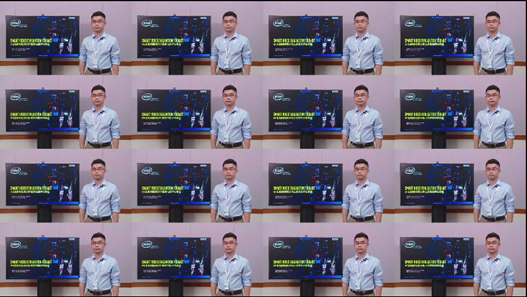

<!--hide_directive
```{eval-rst}
:orphan:
```
hide_directive-->

# Smart Video Evaluation Tool 2 Guide

- **Time to Complete:** 20min
- **Programming Language:** C++

> **Note:** SVET2 is a legacy solution.

## About SVET2

**Smart Video Evaluation Tool 2 (SVET2)** is the NVR-focused reference application in this
sample. Its binary is `svet_app`, and it is based on the Video Processing Platform SDK. Instead of writing
code, you describe a video composition workload — decode, composition (multiview), and
concurrent display — in a text configuration file, and `svet_app` executes it. This makes
SVET2 well suited for performance evaluation and as an implementation reference.

This guide covers installing the dependencies, building `svet_app`, and running example NVR
workloads from configuration files. For the workload model and the high-level architecture of
`svet_app`, see [How It Works](./how-it-works.md#svet2-application-architecture).

`svet_app` uses a configuration file to specify the parameters of each function block, like
the input video file path, codec, a display channel's position on the video layer, the video
layer's resolution, and the composition fps. The `svet2/sample_config` folder contains sample
configuration files. For descriptions of each configuration file and the configuration options,
refer to [svet2/sample_config/README.md](https://github.com/open-edge-platform/edge-ai-suites/blob/release-2026.1.0/metro-ai-suite/video-processing-for-nvr/svet2/sample_config/README.md).

## Prerequisites

**Operating System:**

- Ubuntu 24.04

**Software:**

- Video Processing Platform SDK

## Installation Guide

### 1 System Installation

Install Ubuntu\* 24.04, set up the network correctly, and run the sudo apt update.

### 2 Install Software Dependencies

The `svet_app` sample application depends on the Video Processing Platform SDK for video decode,
encoding, and post-processing functionalities. It also depends on the live555 library for RTSP
streaming.

#### 2.1 Install the Video Processing Platform SDK

Install the Video Processing Platform SDK first.

```
sudo -E wget -O- https://eci.intel.com/sed-repos/gpg-keys/GPG-PUB-KEY-INTEL-SED.gpg | sudo tee /usr/share/keyrings/sed-archive-keyring.gpg > /dev/null
echo "deb [signed-by=/usr/share/keyrings/sed-archive-keyring.gpg] https://eci.intel.com/sed-repos/$(source /etc/os-release && echo $VERSION_CODENAME) sed main" | sudo tee /etc/apt/sources.list.d/sed.list
echo "deb-src [signed-by=/usr/share/keyrings/sed-archive-keyring.gpg] https://eci.intel.com/sed-repos/$(source /etc/os-release && echo $VERSION_CODENAME) sed main" | sudo tee -a /etc/apt/sources.list.d/sed.list
sudo bash -c 'echo -e "Package: *\nPin: origin eci.intel.com\nPin-Priority: 1000" > /etc/apt/preferences.d/sed'
sudo apt update
sudo apt install intel-vppsdk

sudo bash /opt/intel/vppsdk/install_vppsdk_dependencies.sh
source /opt/intel/vppsdk/env.sh
```

Assume the Video Processing Platform SDK package directory is `vppsdk` and the default install path is `/opt/intel/media/`.
Run `vainfo` to verify the media stack is installed successfully:

```
# sudo su
# export LIBVA_DRIVER_NAME="iHD"
# export LIBVA_DRIVERS_PATH="/opt/intel/media/lib64"
# /opt/intel/media/bin/vainfo
```

In the terminal, you should see the output similar to what is shown below:

```text
Trying display: drm
libva info: VA-API version 1.22.0
libva info: User environment variable requested driver 'iHD'
libva info: Trying to open /opt/intel/media/lib64/iHD_drv_video.so
libva info: Found init function __vaDriverInit_1_22
libva info: va_openDriver() returns 0
vainfo: VA-API version: 1.22 (libva 2.22.0.1)
vainfo: Driver version: Intel iHD driver for Intel(R) Gen Graphics - 24.2.5 (12561f6)
vainfo: Supported profile and entrypoints
      VAProfileNone                   : VAEntrypointVideoProc
      VAProfileNone                   : VAEntrypointStats
      VAProfileMPEG2Simple            : VAEntrypointVLD
      VAProfileMPEG2Simple            : VAEntrypointEncSlice
```

Then, run a Video Processing Platform SDK API test.

> **Note:** Make sure there is at least one display connected to the device and switch to
> `root` and `init 3` before running the command below:

```
sudo init 3
sudo su

cd /opt/intel/vppsdk/bin
source /opt/intel/vppsdk/env.sh
export MULTI_DISPLAY_PATCH=1
./api_test --gtest_filter=*1_input_pipeline_setup*
```

It will start a decode and display pipeline. On a successful test run, you should see a message similar
to the one below:

```text
[       OK ] testPipeline.1_input_pipeline_setup (23877 ms)
[----------] 1 test from testPipeline (23877 ms total)
[----------] Global test environment tear-down
[==========] 1 test from 1 test suite ran. (23877 ms total)
[  PASSED  ] 1 test.
```

#### 2.2 Install the live555 library

There is a `live555_install.sh` under the root directory of svet_app source code package. With a working network connection on your system, run this script: it will download, build, and install live555 libraries. The libraries will be installed to `/usr/local/lib/`.

### 3 Build the svet_app sample application

If you have not run the commands below in the current terminal, run them first to set up the
correct environment variables:

```
$ source /opt/intel/vppsdk/env.sh
$ export LD_LIBRARY_PATH=/usr/local/lib:$LD_LIBRARY_PATH
```

Then run `build.sh` to build the `svet_app` binary:

```
$ ./build.sh
```

If the `build.sh` runs successfully, you can find the `svet_app` binary under the build directory.

## Run the svet_app Sample Application

### 1 Configuration Files

You can pass the configuration file to the `svet_app` with the `load` option.

```
#./build/svet_app load  config_file.txt
```

You can use `quit` or `Ctrl+C` to exit the application.

### 2 Switch to root and set environment variables

Before running the sample application, make sure the environment variables are set correctly in the current bash:

```
# sudo init 3
# sudo su
# source /opt/intel/vppsdk/env.sh
# export LD_LIBRARY_PATH=/usr/local/lib:$LD_LIBRARY_PATH
# export MULTI_DISPLAY_PATCH=1
```

> **Note:** the Video Processing Platform SDK uses drm display, which requires that there is no X server running and with root privileges.

### 3 Run a basic Decode and Display pipeline

Run the command below:

```
# ./build/svet_app load sample_config/basic/1dec1disp.txt
```

It will start to decode the 1080p.h264 and show the video on the 1st display.
The following is the content of the `1dec1disp.txt` configuration file. Each line starts with a subcommand. For all the supported sub-commands and their options, refer to [svet2/sample_config/README.md](https://github.com/open-edge-platform/edge-ai-suites/blob/release-2026.1.0/metro-ai-suite/video-processing-for-nvr/svet2/sample_config/README.md).

```
newvl -I 0 -W 1920 -H 1080 –refresh=60 –fps=30 --format=nv12 --dispid=0
dispch --id=0 -W 1920 -H 1080 -x 0 -y 0 --videolayer 0
newdec --id=0 --input=1080p.h265 --codec=h265  --sink=disp0 -f NV12
ctrl --cmd=run  --time=8000
ctrl --cmd=stop  --time=0
```

The `newvl` line specifies a video layer with display mode 1920x1080@60fps, and the fps of this video layer is 30. `--displayid=0` means the first display is used.
You can run `./build/svet_app load  sample_config/basic/show_displays.txt` to check how many displays are connected and the corresponding display id. In the terminal, it will output the messages below if there are two displays connected. You can specify the displays with the display ids (first column).

```
-------2 displays connected-------
display id      device id       Max resolution  Refresh rate    name
0               318             1920X1080       60
1               326             3840X2160       60
```

### 4 Run 16 Channel Decode and Display Pipeline

Configuration file `sample_config/multiview/16dec_4kdisp.txt` defines workload that includes 16 channel H265 decode, composition to 4K surface and show on display. Below is the command line to run this workload.

```
# ./build/svet_app load sample_config/multiview/16dec_4kdisp.txt
```

You will see a 4x4 video on display:

Figure 3. Screenshot of sample_config/multiview/16dec_4kdisp.txt
The following is the first line of sample_config/multiview/16dec_4kdisp.txt:

```text
Newvl -i 0 -W 3840 -H 2160 --refresh=30 --format=nv12 --dispid=0
```

It chooses display with id=0 and display mode 3840x2160@30. If the maximum resolution of the connected display is 1080p, you can only see the 4 video playbacks in the top left of the above screenshot. This is because svet_app will select the top display mode if it has not found the display mode specified in the configuration file.

### 5 Run 32 Channel Decode on 2 Displays

The configuration file `sample_config/multiview/16_16dec_2disp4k.txt` defines a workload that includes a 16-channel decode and shows on the 1st and 2nd 4k displays.
Below is the command line to run this workload.

```
# ./build/svet_app load sample_config/multiview/16_16dec_2disp4k.txt
```
You need to connect two 4K displays to the system before you run the tests.

Configuration File sample_config/multiview/16dec_4kdisp.txt

```
newvl -i 0 -W 3840 -H 2160 --refresh=30 --format=nv12  --dispid=0
dispch  --id=0 -W 960 -H 540 -x 0 -y 0 --videolayer=0
newdec --id=0 --input=1080p.h265 --codec=h265    --sink=disp0 -f NV12
…
dispch  --id=15 -W 960 -H 540 -x 2880 -y 1620 --videolayer=0
newdec --id=15 --input=1080p.h265 --codec=h265    --sink=disp15 -f NV12
ctrl --cmd=run  --time=0
newvl -i 1 -W 3840  -H 2160  --refresh=30  --format=nv12  --dispid=1
dispch  --id=0 -W 960 -H 540 -x 0 -y 0 --videolayer=1
newdec --id=16 --input=1080p.h265 --codec=h265    --sink=disp0 -f NV12
…
dispch  --id=15 -W 960 -H 540 -x 2880 -y 1620 --videolayer=1
newdec --id=31 --input=1080p.h265 --codec=h265    --sink=disp15 -f NV12
ctrl --cmd=run  --time=15000
ctrl --cmd=stop  --time=0
```

## Uninstall

### Uninstall the svet_app application

`sudo rm -rf build`

### Uninstall live555

`xargs sudo rm < live555-master/build/install_manifest.txt`
`sudo rm -rf live555-master`

### Uninstall the Video Processing Platform SDK

`sudo apt remove intel-vppsdk`
`sudo rm -rf /opt/intel/vppsdk`
`sudo rm -rf /opt/intel/media`

## Run the svet_app Sample Application in Docker

Build Docker image and Run in Docker container, for information see the [Docker README](https://github.com/open-edge-platform/edge-ai-suites/blob/release-2026.1.0/metro-ai-suite/video-processing-for-nvr/docker/README.md).
